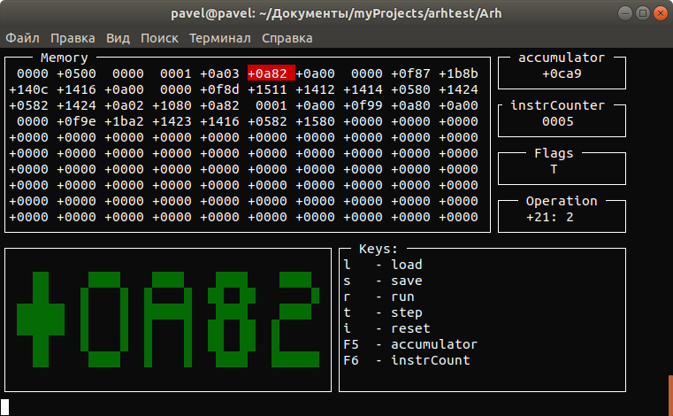

## Simple computer
This project is a model of computer, which can show the progress of the program. It consists of the following functional blocks:
* Registers(accumulator, instruction counter, flags register);
* ALU
* CU
* Memory access interface
### Command format
0 0010101 0110100
* The first bit is command tag
* From 2 to 8 bits are code operation
* Last 7 bits are operand
### CPU commands

|Designation|Code|Description|
|:------:|:--:|----------------------------|
|READ|10|Input value from the terminal|
|WRITE|11|Output value to the terminal|
|LOAD|20|Load value to accumulator from the specified memory cell|
|STORE|21|Unloads value from accumulator to the specified memory cell|
|ADD|30|Performs the addition of a word in the accumulator and specified memory cell|
|SUB|31|Performs the subtraction of a word in the accumulator and specified memory cell|
|DIVIDE|32|Performs the devision of a word in the accumulator and specified memory cell|
|MUL|33|Performs the multiplies of a word in the accumulator and specified memory cell|
|JUMP|40|Unconditional transition to the specified memory cell|
|JNEG|41|Transition to the memory cell, if the accumulator is negative|
|JNEG|42|Transition to the memory cell, if the accumulator is equal to zero|
|HALT|43|Executed when the program ends|
|OR|53|OR operation between accumulator and the memory cell|
|JNS|55|Transition to the memory cell, if the accumulator is positive|

### Interface



Interface consist of the following areas:
* _Memory_ - contents of RAM of simple computer
* _Accumulator_ - value in accumulator
* _InstrCounter_ - value of the register "Instraction counter"
* _Operation_ - result decoding operation
* _Flags_ - state of flags register(P - overflow, O - dividing by zero, M - memory overrun, T - ignore clock pulses, E - wrong command)
* _Keys_ - hint by functional keys

## Simple Assembler

This program translates the program written in Simple Assembler to binary form, which can be read by simple computer.
Each line of Simple Accembler program consist of 3 fields: memory cell address, command and operand. Comments are also allowed, after ";" symbol.

### Example of using Simple Assembler

```console
$ make assembler
$ ./satr programs/factorial.sa
```

The translated program will be located in data/RAM.b so you can load it to Simple computer by pressing 'l'.

## Simple basic

Simple pasic is a high-level program language. Simple Basic compiler translate the program written in Simple Basic to Simple Assembler.
The following operators are used in the language:
* REM    - comment
* INPUT  - input value from the console
* OUTPUT - output value to the console
* LET    - operation over variable( "*", "/", "-", "+", "(", ")")
* GOTO   - Unconditional transition
* IF     - Condition
* END

Variable name can consist of only one letter. The compiler recognizes only uppercase letters.

### Example of using Simple Assembler

```console
$ make compiler
$ ./scompiler programs/factorial.sb programs/factorial.sa
```